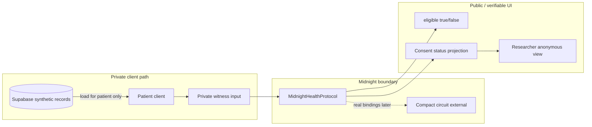

# Architecture

Polaris is a privacy-preserving research matching and programmable consent MVP (Midnight Hack Buenos Aires 2026). Patients prove eligibility for Study #001 (Type 2 Diabetes) and manage consent without putting raw medical attributes on a public SQL matching path.

**License:** Apache-2.0 (see repository `LICENSE`).

---

## Actors

| Actor | Role |
|-------|------|
| **Patient** | Owns synthetic private medical credentials; proves eligibility; grants/revokes consent |
| **Trusted medical issuer** | Simulated as `HOSPITAL_DEMO` (`verified: true` on seed data) |
| **Researcher** | Defines Study #001; sees only anonymous eligibility / consent projections |

---

## Non-negotiable core rule

Eligibility is **not** evaluated by:

- Supabase `WHERE` filters on medical columns (product path)
- React business rules that decide match on the product path

Flow:

```
Supabase / local synthetic record
  → patient client
  → EligibilityProofInput (private witness)
  → MidnightHealthProtocol.proveEligibility()
  → { eligible, proofReference, transactionId }
```



---

## Layers

| Layer | Path | Role |
|-------|------|------|
| Domain | `src/domain` | Medical types, Study #001 constants, eligibility/consent/reward state machines |
| Types | `src/types` | Sanitized Midnight I/O types |
| Supabase | `src/lib/supabase` | Prototype storage + UI projections (anon key) |
| Midnight | `src/lib/midnight` | Compact integration boundary (`MidnightHealthProtocol`) |
| Wallet | `src/lib/wallet` | Wallet adapter boundary (1am mapping pending) |
| Features / UI | `src/features`, `src/components`, `src/app` | Four product screens + shared trust UI |
| Midnight package | `midnight/` | Contracts / generated / integration placeholders |
| Data | `supabase/migrations`, `supabase/seed.sql` | Schema + synthetic seed |
| Tests | `tests/` | Vitest — app/demo logic, not Compact verification |

---

## Product screens

| Route | Responsibility |
|-------|----------------|
| `/vault` | Health vault: verified attributes, private-data copy, connect wallet |
| `/studies` | Study #001 opportunity; **Check Eligibility Privately** |
| `/eligibility` | Result + **PROVED** / **NOT DISCLOSED**; grant / revoke consent |
| `/researcher` | Counts + `anon_*` rows only |

Home (`/`) redirects to `/vault`.

---

## Adapters

### Midnight

| Implementation | Selection | Behavior |
|----------------|-----------|----------|
| `MidnightAdapter` | Default (`createMidnightProtocol`) | Throws `Midnight adapter not connected` until real Compact bindings + proof/tx path are wired |
| `DemoMidnightAdapter` | `NEXT_PUBLIC_ENABLE_DEMO_MIDNIGHT=true` | Local criteria evaluation only; label **DEMO PRIVACY ENGINE**; never claim ZK verified on Midnight |

Wiring details: [midnight/README.md](../midnight/README.md), [midnight/integration/README.md](../midnight/integration/README.md).

### Wallet

`WalletAdapter` exposes `connect | disconnect | getAddress | isConnected | signAndSubmit`. Official 1am / DApp Connector methods map into this interface later — no invented SDK surface in app code.

---

## State machines

Explicit machines (not boolean soup) under `src/domain/state/`:

| Machine | States (summary) |
|---------|------------------|
| Eligibility | `idle` → `checking` → `eligible` / `not_eligible` / `error` |
| Consent | `none` → `pending` → `active` / `revoked` / `expired` / `error` |
| Reward | `unavailable` → `available` → `claiming` → `claimed` / `error` |

App state is coordinated via feature provider(s) under `src/features/app/`.

---

## Data stores

### Supabase (prototype)

| Table | Role |
|-------|------|
| `patient_profiles` | Patient alias / wallet linkage |
| `medical_records` | Synthetic private vault data (prototype storage only) |
| `studies` | Study #001 criteria metadata for UI |
| `consent_views` | **UI projection only** — not consent source of truth |

RLS enabled; client uses anon/publishable key only. Never put the service-role key in the browser bundle.

### Midnight (intended SoT)

Once Compact contracts are connected:

- Eligibility proofs and consent transitions are verified on Midnight.
- Public ledger holds only intentionally disclosed fields (status, commitments, anonymous tokens — as designed).
- Private medical witness data never becomes ledger plaintext.

---

## Consent source of truth

`consent_views` in Supabase is an optional **UI projection**. Consent **source of truth** is intended to be Midnight once contracts are connected. Demo mode keeps an in-memory consent map inside `DemoMidnightAdapter` for walkthroughs only.

---

## Issuer (production note)

MVP uses a simulated issuer (`HOSPITAL_DEMO`, `verified: true`). Production would require authentic credential issuance and verification by real medical institutions — **out of scope** for this hackathon.

---

## Error surfaces

User-visible failures (sanitized): wallet not connected, adapter unavailable, proof failed, not eligible, study inactive, consent revoked/expired, reward already claimed. Private medical attributes must never appear in error strings or logs.

---

## Out of scope (enforced)

Medical NFTs, marketplaces, staking, multi-token economies, AI diagnosis, IPFS, Lace/Cardano-as-primary-wallet, real patient data, fake Compact syntax, fake generated bindings, eligibility via SQL product path.
